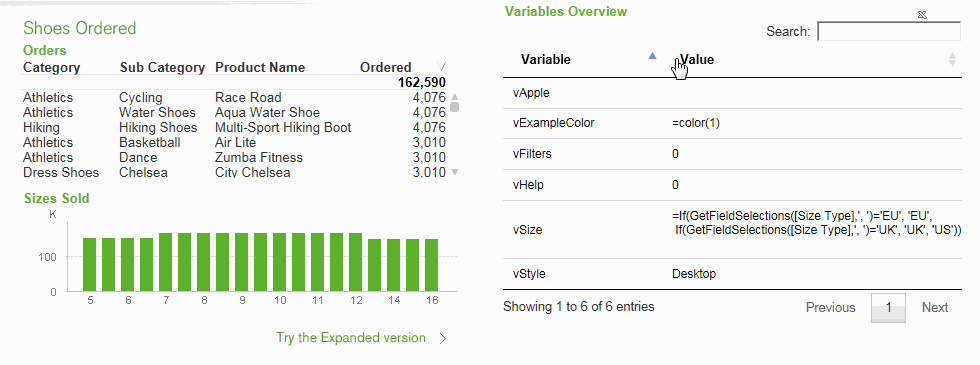

QlikView Extensions Variables Table Editor
==========================================

This extension implements DataTable Plugin for jQuery: http://www.datatables.net/ and lists all document variables.
You can page thru the list, sort and search, and also edit (and store) variable values by clicking on the value.
This gives you a good overview and makes it more handy when developing QlikView apps.

